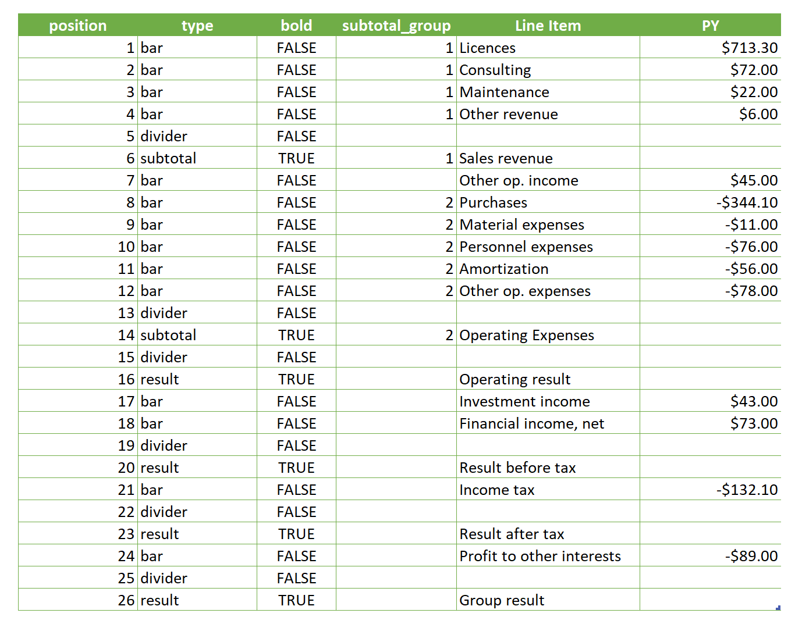
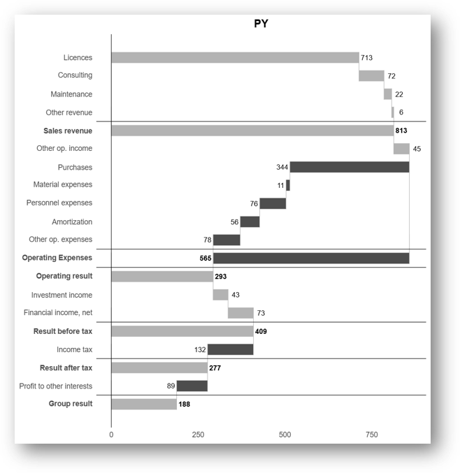

# plotibcs

### Data-driven helper functions to quickly produce IBCS-compliant charts

## Installation

You can install the development version from this repo:

```r
# install.packages("devtools")
devtools::install_github("ncalm/plotibcs")
```

## Included functions

1. plot_ibcs_waterfall

The purpose of this function is to mimic chart type 12 described on the ibcs website [here](https://www.ibcs.com/resource/chart-template-12/)

One example given is this:


My intent with this function is to recreate the vertical waterfall from that template with a minimal amount of setup for the user. 

As an example, this table:



Which must be defined as follows:
- position (integer) non null
- type (character) non null, taking one of these values:
  - bar, for drawing a bar for a line item
  - subtotal, which positions a subtotal for a collection of bars (see subtotal_group)
  - divider, which draws a horizontal line between two adjacent bars
  - result, which draws a bar from zero to the end value of the prior bar
- bold (logical) non null, indicating if the labels for this bar should be bold
- subtotal_group (integer), indicating which bars should be summed together. Generally each group should have one or more rows with type='bar' and exactly one row with type='subtotal'. Nulls in this column will not contribute to any subtotals. Similarly, subtotal rows with no group will not be drawn.
- One character column of bar labels. Nulls are allowed on divider rows.
- One numeric column of line item values. You need only provide values for rows with type 'bar' since subtotals and results are computed by the function.

Is passed into the function like this:

```r
# df is a tibble of the table shown above
plot_ibcs_waterfall(df, title = "Previous Year", value_col = "PY", label_col = "Line Item")
```

And produces this chart:



In addition to using the chart in standard R scripts and in RStudio, you can use Anaconda Code from the Anaconda Toolbox for Excel add-in to run R directly in Excel. You are welcome to explore how the function works using [this example file](examples/plotibcs_plot_ibcs_waterfall.xlsx).
